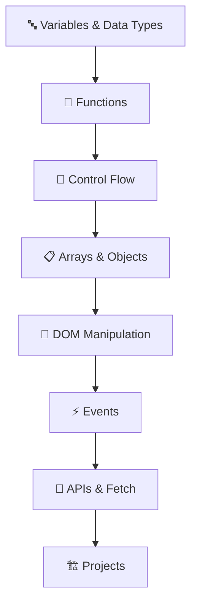

<div align="center">

# 🚀 JavaScript Learning Journey

_Master the fundamentals and beyond with hands-on examples_

[](https://developer.mozilla.org/en-US/docs/Web/JavaScript)
[](https://nodejs.org/)
[](LICENSE)


</div>

---

## 📚 Table of Contents

- [🎯 Overview](#-overview)
- [🛠️ Prerequisites](#️-prerequisites)
- [📖 Learning Path](#-learning-path)
- [🏗️ Project Structure](#️-project-structure)
- [🚀 Getting Started](#-getting-started)
- [📝 Code Examples](#-code-examples)
- [🎨 Features Covered](#-features-covered)
- [📚 Resources](#-resources)
- [🤝 Contributing](#-contributing)
- [📄 License](#-license)

---

## 🎯 Overview

This repository contains my journey learning JavaScript from fundamentals to advanced concepts. Following along with comprehensive tutorials and building real-world projects to solidify understanding.

> **Learning Source**: [JavaScript Full Course](https://www.youtube.com/watch?v=EerdGm-ehJQ)

### 🌟 What You'll Find Here

- ✅ **Beginner-friendly examples** with detailed comments
- ✅ **Hands-on projects** to practice concepts
- ✅ **Modern JavaScript (ES6+)** features and syntax
- ✅ **Best practices** and coding standards
- ✅ **Real-world applications** and use cases

---

## 🛠️ Prerequisites

Before diving in, make sure you have:

- 💻 A code editor (VS Code recommended)
- 🌐 A modern web browser (Chrome, Firefox, Safari)
- 📦 Node.js (for running JavaScript outside the browser)
- 🧠 Basic understanding of HTML/CSS (helpful but not required)

---

## 📖 Learning Path



### 📚 Course Modules

| Module | Topic                      | Status | Files              |
| ------ | -------------------------- | ------ | ------------------ |
| 01     | **Getting Started**        | ✅     | `basics/`          |
| 02     | **Variables & Data Types** | ✅     | `variables/`       |
| 03     | **Functions**              | ✅     | `functions/`       |
| 04     | **Control Structures**     | 🔄     | `control-flow/`    |
| 05     | **Arrays & Objects**       | ⏳     | `data-structures/` |
| 06     | **DOM Manipulation**       | ⏳     | `dom/`             |
| 07     | **Events & Listeners**     | ⏳     | `events/`          |
| 08     | **Async JavaScript**       | ⏳     | `async/`           |
| 09     | **Projects**               | ⏳     | `projects/`        |

**Legend:** ✅ Complete | 🔄 In Progress | ⏳ Planned

---

## 🏗️ Project Structure

```
JS/
├── 📁 basics/              # Fundamental concepts
├── 📁 variables/           # Variable declarations & scope
├── 📁 functions/           # Function types & usage
├── 📁 control-flow/        # Loops, conditionals
├── 📁 data-structures/     # Arrays, objects, maps
├── 📁 dom/                 # DOM manipulation examples
├── 📁 events/              # Event handling
├── 📁 async/               # Promises, async/await
├── 📁 projects/            # Practice projects
│   ├── 🎯 calculator/
│   ├── 📋 todo-app/
│   └── 🎮 simple-game/
├── 📁 exercises/           # Practice problems
├── 📁 notes/               # Study notes & cheatsheets
└── 📄 README.md
```

---

## 📝 Code Examples

### 🔤 Variables & Constants

```javascript
// Modern variable declarations
let name = "JavaScript";
const year = 2024;
var oldStyle = "avoid this"; // Avoid var

console.log(`Learning ${name} in ${year}! 🚀`);
```

### 🔧 Functions

```javascript
// Arrow function (ES6+)
const greet = (name) => `Hello, ${name}! 👋`;

// Traditional function
function calculateArea(radius) {
  return Math.PI * radius ** 2;
}

console.log(greet("World"));
console.log(`Circle area: ${calculateArea(5).toFixed(2)}`);
```

### 📋 Arrays & Methods

```javascript
const fruits = ["🍎", "🍌", "🍊"];

// Modern array methods
fruits.forEach((fruit) => console.log(fruit));
const upperFruits = fruits.map((fruit) => fruit.toUpperCase());
const apples = fruits.filter((fruit) => fruit.includes("🍎"));
```

---

## 🎨 Features Covered

<div align="center">

| Core Concepts     | Advanced Topics | Projects       |
| ----------------- | --------------- | -------------- |
| Variables & Types | Async/Await     | Calculator     |
| Functions         | Promises        | Todo App       |
| Objects & Arrays  | Modules         | Weather App    |
| DOM Manipulation  | Error Handling  | Simple Game    |
| Event Handling    | Fetch API       | Portfolio Site |
| Control Flow      | Local Storage   | Quiz App       |

</div>

---

## 📚 Resources

### 🔗 Helpful Links

- 📖 [MDN JavaScript Guide](https://developer.mozilla.org/en-US/docs/Web/JavaScript/Guide)
- 🎮 [JavaScript.info](https://javascript.info/)
- 💻 [FreeCodeCamp](https://www.freecodecamp.org/)
- 🏋️ [Exercism JavaScript Track](https://exercism.org/tracks/javascript)

### 🛠️ Tools Used

- **Editor**: Visual Studio Code
- **Browser**: Chrome DevTools
- **Runtime**: Node.js
- **Version Control**: Git & GitHub

---
